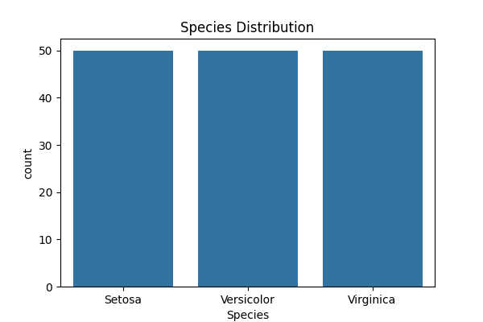
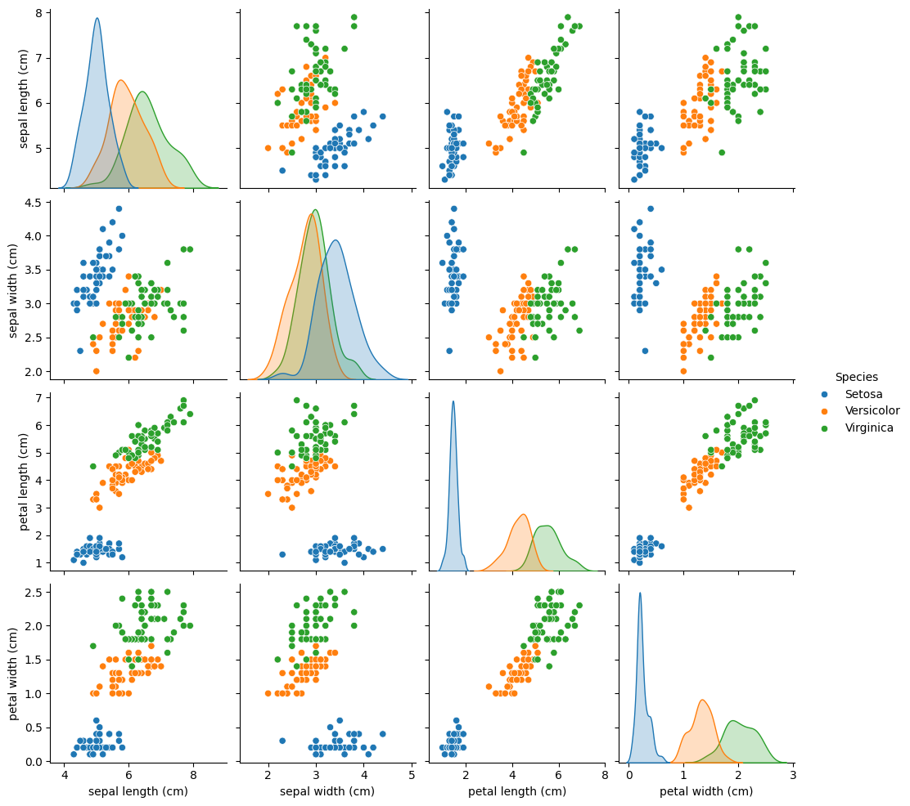
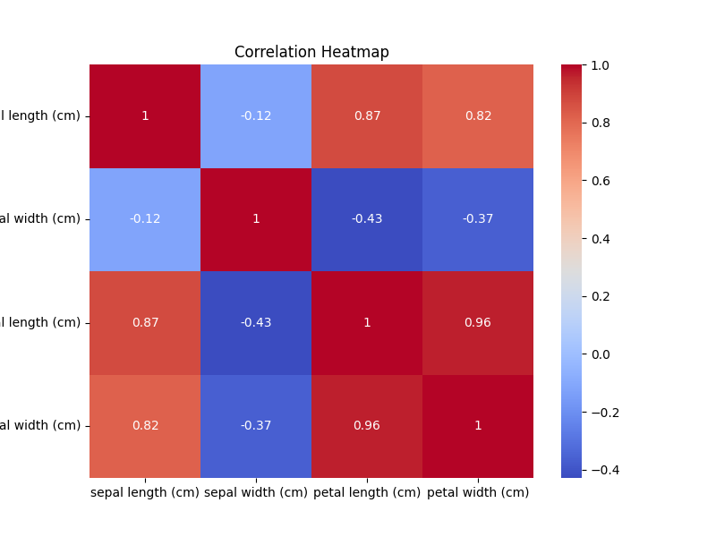
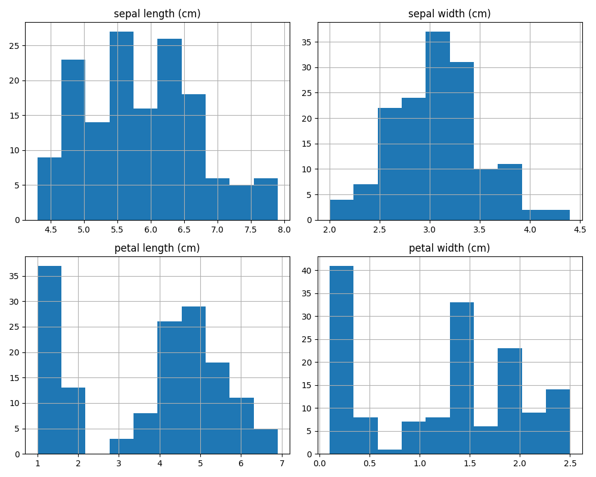
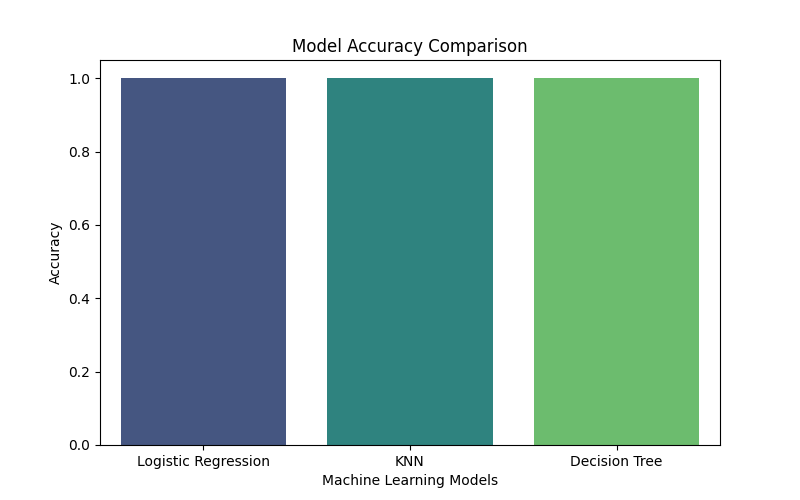

# 🌸 Iris Flower Classification using Machine Learning

## 📌 Project Overview

This project was developed as part of the **Oasis Infobyte Data Science Internship**.

The objective is to classify Iris flowers into three species:

- 🌼 Setosa
- 🌸 Versicolor
- 🌺 Virginica

using Machine Learning algorithms.

---

## 🎯 Objective

Build a Machine Learning model that accurately predicts the species of an Iris flower based on its sepal and petal measurements.

---

## 🛠️ Technologies Used

- Python
- Pandas
- NumPy
- Matplotlib
- Seaborn
- Scikit-learn

---

## 📂 Dataset

The Iris dataset is loaded from the **Scikit-learn** library.

### Dataset Information

- Total Samples: **150**
- Features: **4**
- Classes: **3**

Features:

- Sepal Length
- Sepal Width
- Petal Length
- Petal Width

---

# 📸 Project Screenshots

## 🌼 Species Distribution



---

## 🌸 Pair Plot



---

## 📦 Box Plot

.png)

---

## 🔥 Correlation Heatmap



---

## 📊 Histogram



---

## 🤖 Model Accuracy Comparison



---

## 🤖 Machine Learning Models Used

- Logistic Regression
- K-Nearest Neighbors (KNN)
- Decision Tree Classifier

---

## 📈 Model Performance

| Model | Accuracy |
|--------|----------|
| Logistic Regression | **100%** |
| K-Nearest Neighbors | **100%** |
| Decision Tree | **100%** |

---

## 🔍 Prediction

Example Prediction

```text
Predicted Flower Species:
Setosa
```

---

## 📁 Project Structure

```text
DataScience-Task1-IrisFlowerClassification/
│── iris_flower_classification.py
│── README.md
│── requirements.txt
└── screenshots/
    ├── countplot.png
    ├── pairplot.png
    ├── heatmap.png
    ├── histogram.png
    ├── model_comparison.png
```

---

## 🚀 How to Run

Install dependencies

```bash
pip install -r requirements.txt
```

Run the project

```bash
python iris_flower_classification.py
```

---

## 📌 Conclusion

This project demonstrates the complete Machine Learning workflow:

- Data Loading
- Data Cleaning
- Exploratory Data Analysis (EDA)
- Data Visualization
- Feature Scaling
- Model Training
- Model Evaluation
- Prediction

All three models achieved excellent performance on the Iris dataset.

---

## 👨‍💻 Author

**Grandhi Sajith**

Oasis Infobyte Data Science Internship
