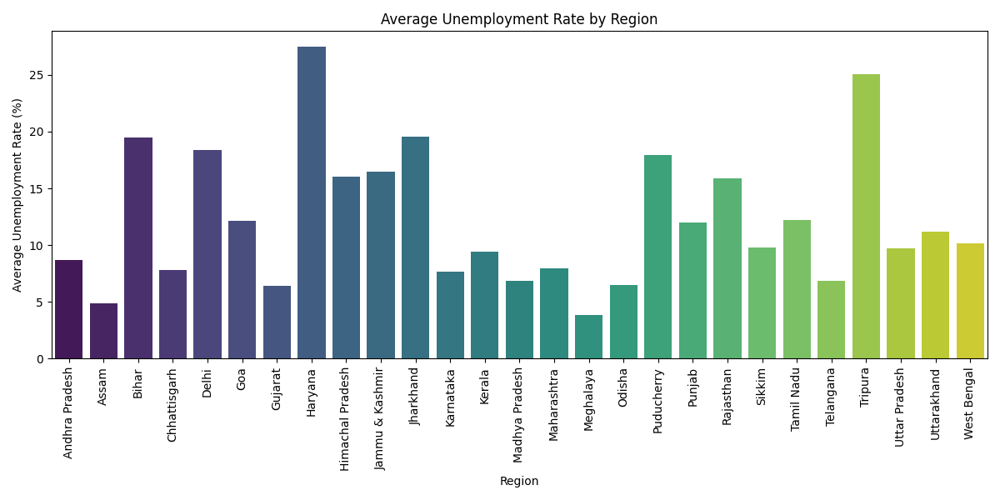
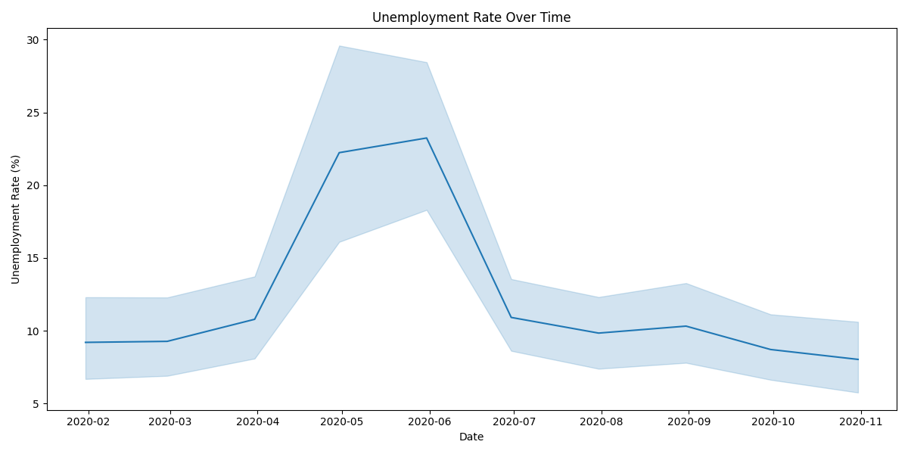
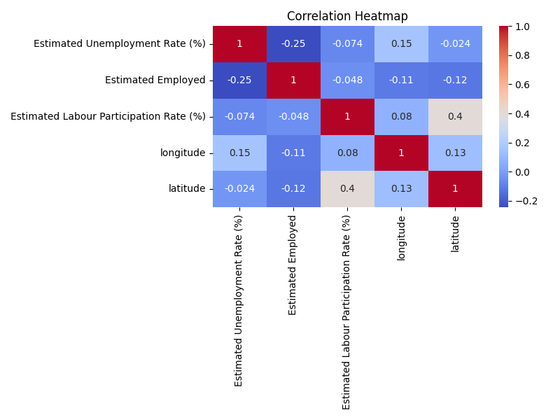
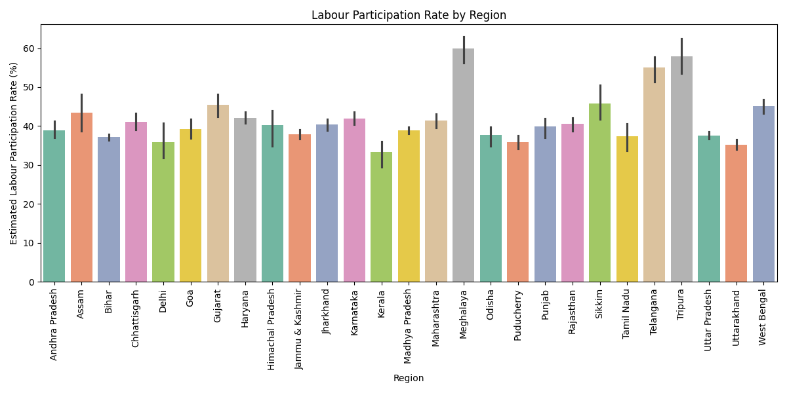
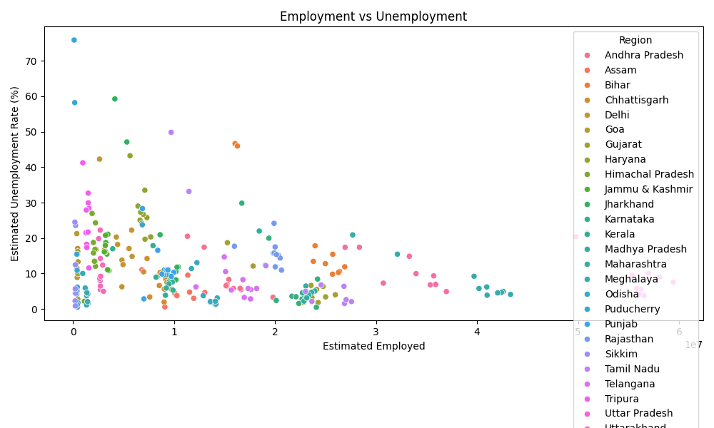

# 📊 Unemployment Analysis with Python

## 📌 Project Overview

This project was developed as part of the **Oasis Infobyte Data Science Internship**.

The objective is to analyze unemployment trends in India using Python and visualize the data through different charts.

---

## 🎯 Objective

- Analyze unemployment data in India.
- Clean and preprocess the dataset.
- Visualize unemployment trends.
- Compare unemployment rates across different regions.
- Generate meaningful insights using data analysis.

---

## 🛠️ Technologies Used

- Python
- Pandas
- NumPy
- Matplotlib
- Seaborn

---

## 📂 Dataset

Dataset Used:

**Unemployment_Rate_upto_11_2020.csv**

### Dataset Features

- Region
- Date
- Frequency
- Estimated Unemployment Rate (%)
- Estimated Employed
- Estimated Labour Participation Rate (%)
- Longitude
- Latitude

---

# 📸 Project Screenshots

## 📊 Average Unemployment Rate by Region



---

## 📈 Unemployment Trend Over Time



---

## 🔥 Correlation Heatmap



---

## 👨‍💼 Labour Participation Rate



---

## 📉 Employment vs Unemployment



---

## 📊 Data Analysis Performed

- Data Cleaning
- Missing Value Analysis
- Statistical Summary
- Regional Analysis
- Trend Analysis
- Correlation Analysis
- Data Visualization

---

## 📈 Key Insights

- Cleaned the unemployment dataset.
- Compared unemployment rates across different states.
- Visualized unemployment trends over time.
- Studied labour participation rates.
- Identified relationships between employment and unemployment.

---

## 📁 Project Structure

```text
DataScience-Task2-UnemploymentAnalysis/
│── unemployment_analysis.py
│── Unemployment_Rate_upto_11_2020.csv
│── README.md
│── requirements.txt
└── screenshots/
    ├── region_unemployment.png
    ├── unemployment_trend.png
    ├── heatmap.png
    ├── labour_participation.png
    └── scatter_plot.png
```

---

## 🚀 How to Run

### Install Dependencies

```bash
pip install -r requirements.txt
```

### Run the Project

```bash
python unemployment_analysis.py
```

---

## 📌 Conclusion

This project demonstrates how Python can be used for data analysis and visualization to understand unemployment trends across India.

The project includes:

- Data Cleaning
- Exploratory Data Analysis (EDA)
- Data Visualization
- Trend Analysis
- Correlation Analysis
- Insight Generation

---

## 👨‍💻 Author

**Grandhi Sajith**

Oasis Infobyte Data Science Internship
