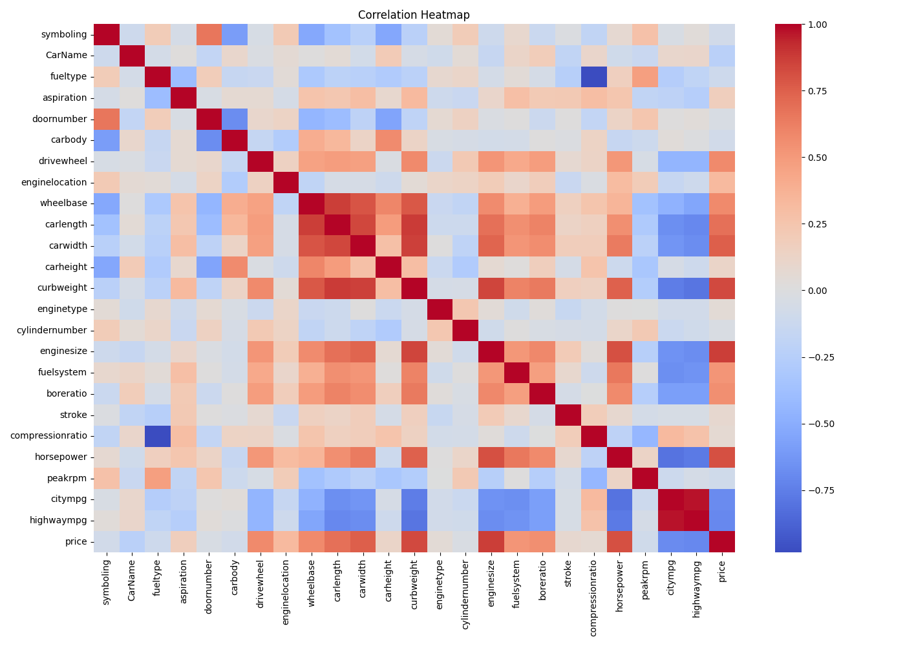
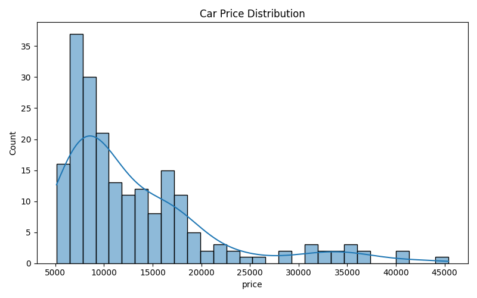
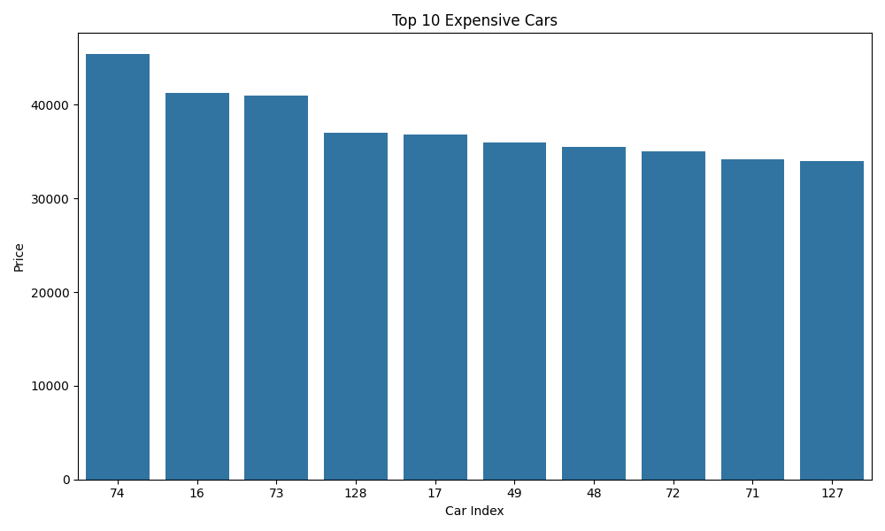
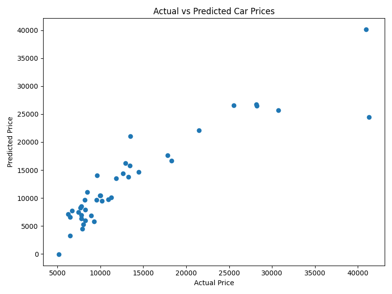
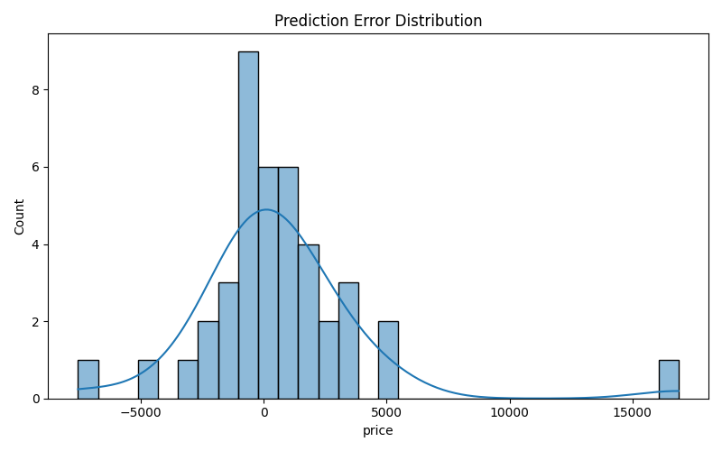
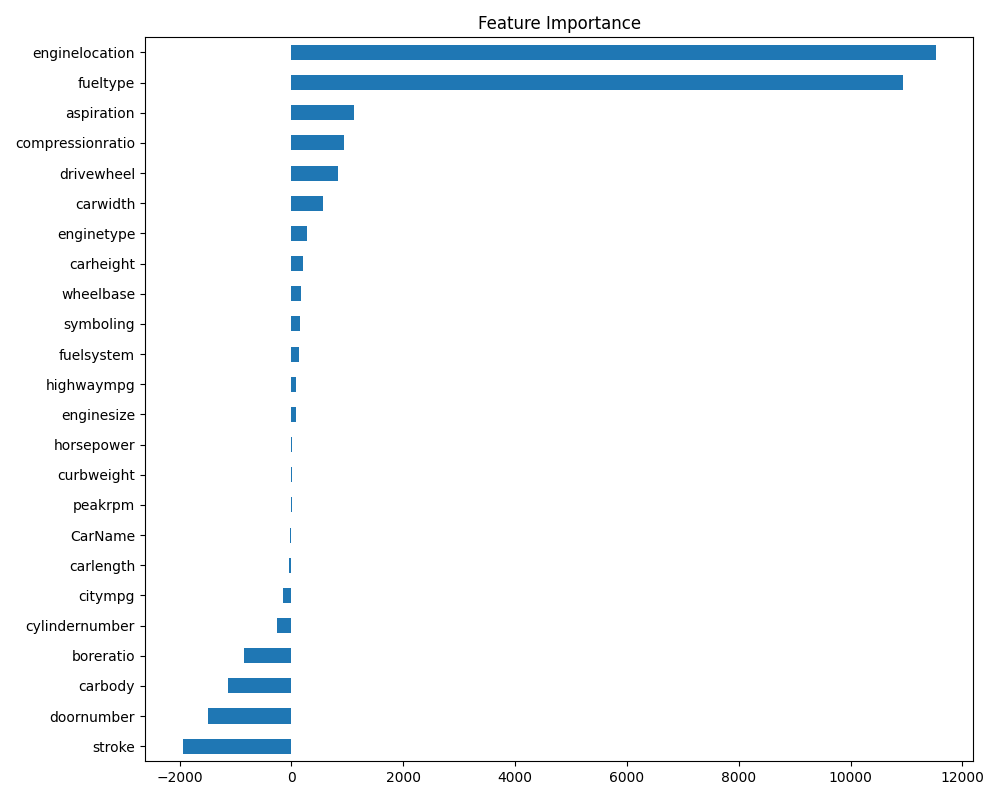

# 🚗 Car Price Prediction using Machine Learning

## 📌 Project Overview

This project was developed as part of the **Oasis Infobyte Data Science Internship**.

The objective of this project is to predict the selling price of a car using Machine Learning techniques based on different vehicle features such as engine size, horsepower, fuel type, car width, and more.

---

# 🎯 Objective

- Analyze the car price dataset.
- Perform data preprocessing and cleaning.
- Visualize important relationships in the dataset.
- Train a Machine Learning model.
- Predict car prices accurately.
- Evaluate model performance.

---

# 🛠️ Technologies Used

- Python
- Pandas
- NumPy
- Matplotlib
- Seaborn
- Scikit-learn

---

# 📂 Dataset

Dataset Used:

**CarPrice_Assignment.csv**

The dataset contains information about different cars, including:

- Car Name
- Fuel Type
- Aspiration
- Car Body
- Drive Wheel
- Horsepower
- Engine Size
- Car Width
- Car Height
- Curb Weight
- Compression Ratio
- Peak RPM
- Price

---

# 📊 Exploratory Data Analysis (EDA)

The following analyses were performed:

- Dataset Information
- Missing Value Analysis
- Data Cleaning
- Label Encoding
- Correlation Analysis
- Feature Importance
- Price Distribution
- Model Evaluation

---

# 📸 Project Screenshots

## 🔥 Correlation Heatmap



---

## 💰 Car Price Distribution



---

## 🚘 Top 10 Most Expensive Cars



---

## 📈 Actual vs Predicted Prices



---

## 📉 Prediction Error Distribution



---

## ⭐ Feature Importance



---

# 🤖 Machine Learning Model

The following Machine Learning algorithm was used:

- Linear Regression

---

# 📈 Model Evaluation

The model was evaluated using:

- Mean Absolute Error (MAE)
- Mean Squared Error (MSE)
- Root Mean Squared Error (RMSE)
- R² Score

---

# 📁 Project Structure

```text
DataScience-Task3-CarPricePrediction/
│── car_price_prediction.py
│── CarPrice_Assignment.csv
│── README.md
│── requirements.txt
└── screenshots/
    ├── heatmap.png
    ├── price_distribution.png
    ├── top10_expensive_cars.png
    ├── actual_vs_predicted.png
    ├── error_distribution.png
    └── feature_importance.png
```

---

# 🚀 How to Run

### 1️⃣ Install Dependencies

```bash
pip install -r requirements.txt
```

### 2️⃣ Run the Project

```bash
python car_price_prediction.py
```

---

# 📊 Project Workflow

- Load Dataset
- Data Cleaning
- Handle Missing Values
- Encode Categorical Features
- Exploratory Data Analysis (EDA)
- Data Visualization
- Train-Test Split
- Linear Regression Model Training
- Model Evaluation
- Car Price Prediction

---

# 📌 Results

- Successfully cleaned and preprocessed the dataset.
- Visualized important patterns and relationships.
- Built a Linear Regression model.
- Predicted car prices using the trained model.
- Evaluated the model using standard regression metrics.

---

# 📌 Conclusion

This project demonstrates a complete Machine Learning workflow for predicting car prices. By preprocessing the dataset, visualizing the data, training a Linear Regression model, and evaluating its performance, the project shows how regression techniques can be applied to real-world datasets for price prediction.

---

# 👨‍💻 Author

**Grandhi Sajith**

**Oasis Infobyte Data Science Internship**
